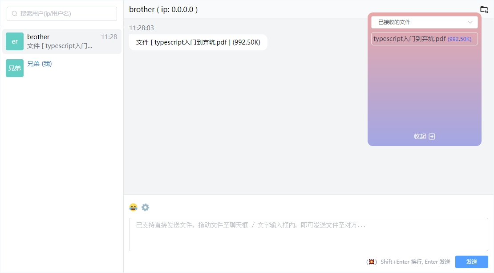

# 一个在网页端聊天和文件传输的工具

可以在web端中实现P2P文件传输与聊天的功能。

---


## 安装

### 前端

基于Vue2.7 + Vite + WebRTC。
注意在 **.env** 文件中配置 socket 服务的地址 (参考 .env.example )。

```shell
# 安装
yarn install

# 启动
yarn dev

# 打包
yarn build
```

---

### 服务端

基于 Node + Express + socket.io

```shell
# 进入服务端目录
cd /server

# 安装
yarn install

# 启动 (或者使用 pm2 进行托管)
node app.js
```

---

## 图示


---

## 已实现功能

- [x] 单聊、历史聊天记录
- [x] 表情选择器
- [x] 右键聊天信息菜单(删除,复制)
- [x] 单聊文件传输
- [x] 文件发送进度提示
- [x] 适配electron端(消息提示、用户信息)

---

## 待实现功能

- [ ] 已发送的文件保存至indexedDB
- [ ] 历史文件列表
